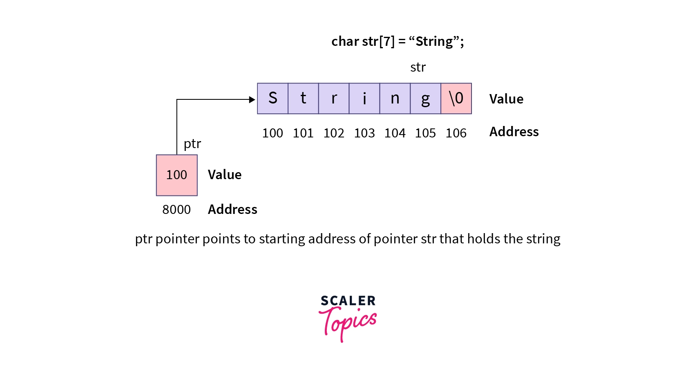

# Pointers

## Variables and Memory

When you refer to a variable, the compiler takes 2 steps

1. Get the address that the variable name corresponds to
2. Go to that memory address and retrieves the value

C++ allows us to perform these steps independently:
1. `&x` evaluates to the address of `x`
2. `*(&x)` allows us to take the address of `x` and *dereference* it by retrieving the value at that address

## Why Pointers?

Pointers are memory addresses, and manipulating the memory addresses is much more efficient than manipulating the data itself.
- Pass-by-reference
  - Pass the memory address of the object into functions rather than the object itself, reduce memory usage
  - Manipulate complex data structures effectively
  - Use polymorphism: calling functions on data without knowing data type
  - Used to dynamically allocate and deallocate memory

## What are Pointers?

Pointers are just variables storing integers, and these integers happen to be memory addresses of other variables like `x`. We access the value of `x` by dereferencing the pointer.

<image src=images/image.png width=400>

The pointer `ptr` stores the integer `12310`.

## Pointer Usage

**Declaration:**

```cpp
float *ptr = &x;
```
This points to the float variable `x`.

We can also have pointers to variables of any type:

```cpp
data_type *pointer_name = address
```

**Usage**

We *dereference a pointer* with `*` to access its value:
```cpp
cout<<*ptr // prints the value pointed to by the ptr, which would be the value of x
```

This is how we pass by reference in functions!

We can also use the pointer to modify the values of `x`:
```cpp
*ptr=5 //sets the value of x
```

Without the `*` operator, `ptr` just gives the memory address:
```cpp
cout << ptr; //outputs the memory address of x in base 16
```

## References

```cpp
float y;
float &x = y; //makes x a reference, or alias, of y
```

After these declarations, changing `x` will change `y` as they refer to the same object. References are just pointers that are dereferenced every time they are used. The only difference is:
- references are auto-deferenced, no need to do this explicitly
- cannot change the location of where a reference points, whereas you can do this for pointers
- when writing the value you want to make a reference to, you do not put an `&` for references but you need to do so for pointers

## Confusion between `*` and `&`

Use of `*`:
- When declaring a pointer, `*` is placed before the variable name and after the type name to indicate this is a pointer pointing to a variable of that type
  - commonly done in function parameters


```cpp
// Declaration: * indicates a pointer type
int* ptr;
```

```cpp
void swap(int *x, int *y)
```

> note `int *ptr;` is equivalent and just a matter of style

- When using a pointer that has already been set to some value, `*` is used to dereference it:
```cpp
// Function parameters
void foo(int* p) {
    *p = 20;  // Dereference to modify the pointed-to value
}
```

Use of `&`:
- to indicate a reference data type
  - commonly done in function parameters
```cpp
// Declaration: & indicates a reference type
int x = 5;
int& ref = x;  // ref is a reference to x,
```

```cpp
void swapValues(int &x, int &y)
```

> note that `int& ref` and `int &ref` are equivalent; only a matter of coding style
- take the address of a variable:
```cpp
// Usage: & takes the address of a variable
int* ptr = &x;  // ptr now holds the address of x
```


## Pointers to Pointers

In pointer to pointer, we store the address of one pointer to another pointer. This is also known as multiple indirections owing to the operator’s name.  Here, the first pointer contains the address of the second pointer, which points to the address where the actual variable has its value stored.

```cpp
#include <iostream>
using namespace std;

int main()
{
    int a = 100;
    int *b = &a;
    int **c = &b;
    cout << "Value of variable a is " << a << endl;
    cout << "Address of variable a is " << b << endl;
    cout << "Address of pointer b is " << c << endl;
    return 0;
}
```

## Arrays and Pointers

The *name* of an array *decays to* a pointer to the *first element* of an array, in most contexts. We can do this because all the elements are contiguous. So `arr` is actually the integer address of the first element. However, note that the elements of the array are still values themselves.

```cpp
int arr[5] = {10, 20, 30, 40, 50};
```

- `arr` is the address of the first element (it decays to a pointer to the first element)
- `arr[0]`, `arr[1]` are the actual integer values like `10`,`20` etc
- `&arr[0]`,`&arr[1]` gives you the addresses of these elements

We make use of the fact that C-style arrays are contiguous. This means we can do pointer arithmetic like `arr+1` which returns the address of the second element, and the subarray.

```cpp
int marks[] = {99, 100, 38};
int *p = marks;
cout << "The value of marks[0] is " << *p << endl;
cout << "The value of marks[1] is " << *(p + 1) << endl;
cout << "The value of marks[2] is " << *(p + 2) << endl;
```

will print
```
The value of marks[0] is 99
The value of marks[1] is 100
The value of marks[2] is 38
```

Note that `p`,`q`, and `arr` are basically equivalent here:
```cpp
//p here is a pointer to the array, same as pointer to the first elem in the array
int *p = arr ;
// we have to use & to get the address of the first element, arr[0] will return the value
int *q = &arr[0];
```

### Arrays, Pointers, Strings

We can create an array of strings, where is element is actually a pointer to a character which is the first element of the string
  - allows array to store multiple strings of different lengths efficiently, as each elem is only a pointer to the beginning of the string
  - we can do this because C-style strings have characters in contiguous memory!



```cpp
const char *suitNames[] = {"Clubs", "Diamonds", "Spades", "Clubs"};
cout << "Enter a suit number (1-4): ";
unsigned int suitNum;
cin >> suitNum;
if(suitNum <= 3)
    cout << suitNames[suitNum - 1];
```
> here, we cannot declare `const char suitNames[]` without `*` as this means storing an array of characters, which is not valid here

We commonly use this in the `main` function:

```cpp
int main(int argc, char* argv[]) { body }
```
- `argc` is a nonnegative value representing the number of arguments passed into program (including function name)
- `argv` is a pointer to an array containing `argc+1` elements - each elem in this array is a pointer to the first character of that argument string. The last element is the null pointer.


## Returning Pointers

When you declare a local variable within a function, that variable goes out of scope when the function exits: the memory allocated to it is reclaimed by the operating system, and anything that was stored in that memory may be cleared. Therefore returning a pointer to a local variable declared within the function usually generates a runtime error.

```cpp
// this function returns a pointer
int *getRandNumPtr() {
    int x = rand();  // 'x' is a local variable, it exists only within this function
    return &x;       // DANGER: Returning address of local variable
                     // 'x' will be destroyed when the function exits
}

int main() {
    // This call receives a pointer to memory that is no longer valid
    int *randNumPtr = getRandNumPtr();

    // UNSAFE: Attempting to access memory that may have been reallocated
    // This could crash the program or print unexpected values
    cout << *randNumPtr; // ERROR: Dereferencing an invalid pointer

    return 0;  // Program ends, but behavior is undefined due to invalid memory access
}
```